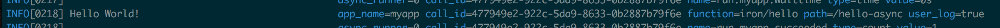

# NONAME... :(

[](https://circleci.com/gh/treeder/functions)
[](https://godoc.org/github.com/treeder/functions)

Welcome to Oracle Functions! The open source serverless platform.

## What is Oracle Functions?

Oracle Functions is an open source serverless platform, or as we like to refer to it, Functions as a
Service (FaaS) platform that you can run anywhere.

* Write once
  * [Any language](docs/faq.md#which-languages-are-supported)
  * [AWS Lambda format supported](docs/lambda/README.md)
* [Run anywhere](docs/faq.md#where-can-i-run-functions)
  * Public, private and hybrid cloud
  * [Import functions directly from Lambda](docs/lambda/import.md) and run them wherever you want
* Easy to use [for developers](docs/README.md#for-developers)
* Easy to manage [for operators](docs/README.md#for-operators)
* Written in [Go](https://golang.org)

## What is Serverless/FaaS?

Serverless is a new paradigm in computing that enables simplicity, efficiency and scalability for both developers
and operators. It's important to distinguish the two, because the benefits differ:

### Benefits for developers

The main benefits that most people refer to are on the developer side and they include:

* No servers to manage (serverless) -- you just upload your code and the platform deals with the infrastructure
* Super simple coding -- no more monoliths! Just simple little bits of code
* Pay by the milliseconds your code is executing -- unlike a typical application that runs 24/7, and you're paying
  24/7, functions only run when needed

Since you'll be running Oracle Functions yourself, the paying part may not apply, but it does apply to
cost savings on your infrastructure bills as you'll read below.

### Benefits for operators

If you will be operating Oracle Functions (the person who has to manage the servers behind the serverless),
then the benefits are different, but related.

* Extremely efficient use of resources
  * Unlike an app/API/microservice that consumes resources 24/7 whether they
    are in use or not, functions are time sliced across your infrastructure and only consume resources while they are
    actually doing something
* Easy to manage and scale
  * Single system for code written in any language or any technology
  * Single system to monitor
  * Scaling is the same for all functions, you don't scale each app independently
  * Scaling is simply adding more Oracle Functions nodes

There is a lot more reading you can do on the topic, just search for 
["what is serverless"](https://www.google.com/webhp?sourceid=chrome-instant&ion=1&espv=2&ie=UTF-8#q=what%20is%20serverless)
and you'll find plenty of information.

## Join Our Community

TODO: Slack or Discord community. 

## Quickstart

This guide will get you up and running in a few minutes.

### Prequisites

* Docker 17.05 or later installed and running
* Logged into Docker Hub (`docker login`)

### Run Oracle Functions

To get started quickly with Oracle Functions, just fire up a `treeder/functions` container:

```sh
docker run --rm -it --name functions -v ${PWD}/data:/app/data -v /var/run/docker.sock:/var/run/docker.sock -p 8080:8080 treeder/functions
```

*where ${PWD}/data is the directory where the functions application data files will be stored*

This will start Oracle Functions in single server mode, using an embedded database and message queue. You can find all the
configuration options [here](docs/operating/options.md). If you are on Windows, check [here](docs/operating/windows.md).

### CLI tool

Install the Oracle Functions CLI tool:

```sh
curl -LSs https://goo.gl/KKDFGn | sh
```

This will download a shell script and execute it.  If the script asks for a password, that is because it invokes sudo.

### Write a Function

Functions are small, bite sized bits of code that do one simple thing. Forget about monoliths when using functions,
just focus on the task that you want the function to perform.

The following is a Go function that just returns "Hello ${NAME}!":

```go
package main

import (
	"encoding/json"
	"fmt"
	"os"
)

type Person struct {
	Name string
}

func main() {
	p := &Person{Name: "World"}
	json.NewDecoder(os.Stdin).Decode(p)
	fmt.Printf("Hello %v!", p.Name)
}
```

Copy and paste the code above into a file called `func.go`, then run the following commands to build your function
and deploy it.

```sh
# Initilize your function, replace $USERNAME with your Docker Hub username.
fn init $USERNAME/hello
# Test it - you can pass data into it too by piping it in, eg: `cat hello.payload.json | fn run`
fn run
# Once it's ready, deploy it to your functions server (default localhost:8080)
fn apps create myapp
fn deploy myapp
```

Now you can call your function:

```sh
curl http://localhost:8080/r/myapp/hello
```

Or surf to it: http://localhost:8080/r/myapp/hello

To update your function:

```sh
# Just update your code and run:
fn deploy myapp
```

See below for more details. And you can find a bunch of examples in various languages in the [examples](examples/) directory. You can also
write your functions in AWS's [Lambda format](docs/lambda/README.md).

## Usage

This is a more detailed explanation of the main commands you'll use in Oracle Functions as a developer.

### Create an Application

An application is essentially a grouping of functions, that put together, form an API. Here's how to create an app.

```sh
fn apps create myapp
```

Or using a cURL:

```sh
curl -H "Content-Type: application/json" -X POST -d '{
    "app": { "name":"myapp" }
}' http://localhost:8080/v1/apps
```

[More on apps](docs/apps.md).

Now that we have an app, we can route endpoints to functions.

### Add a Route

A route is a way to define a path in your application that maps to a function. In this example, we'll map
`/hello` to a simple `Hello World!` function called `treeder/hello` which is a function we already made that you
can use -- yes, you can share functions! The source code for this function is in the [examples directory](examples/hello/go).
You can read more about [writing your own functions here](docs/writing.md).

```sh
fn routes create myapp /hello -i treeder/hello
```

Or using cURL:

```sh
curl -H "Content-Type: application/json" -X POST -d '{
    "route": {
        "path":"/hello",
        "image":"treeder/hello"
    }
}' http://localhost:8080/v1/apps/myapp/routes
```

[More on routes](docs/routes.md).

### Calling your Function

Calling your function is as simple as requesting a URL. Each app has its own namespace and each route mapped to the app.
The app `myapp` that we created above along with the `/hello` route we added would be called via the following
URL: http://localhost:8080/r/myapp/hello

Either surf to it in your browser or use `fn`:

```sh
fn call myapp /hello
```

Or using a cURL:

```sh
curl http://localhost:8080/r/myapp/hello
```

### Passing data into a function

Your function will get the body of the HTTP request via STDIN, and the headers of the request will be passed in
as env vars. You can test a function with the CLI tool:

```sh
echo '{"name":"Johnny"}' | fn call myapp /hello
```

Or using cURL:

```sh
curl -H "Content-Type: application/json" -X POST -d '{
    "name":"Johnny"
}' http://localhost:8080/r/myapp/hello
```

You should see it say `Hello Johnny!` now instead of `Hello World!`.

### Add an asynchronous function

Oracle Functions supports synchronous function calls like we just tried above, and asynchronous for background processing.

Asynchronous function calls are great for tasks that are CPU heavy or take more than a few seconds to complete.
For instance, image processing, video processing, data processing, ETL, etc.
Architecturally, the main difference between synchronous and asynchronous is that requests
to asynchronous functions are put in a queue and executed on upon resource availability so that they do not interfere with the fast synchronous responses required for an API.
Also, since it uses a message queue, you can queue up millions of function calls without worrying about capacity as requests will
just be queued up and run at some point in the future.

To add an asynchronous function, create another route with the `"type":"async"`, for example:

```sh
curl -H "Content-Type: application/json" -X POST -d '{
    "route": {
        "type": "async",
        "path":"/hello-async",
        "image":"treeder/hello"
    }
}' http://localhost:8080/v1/apps/myapp/routes
```

Now if you request this route:

```sh
curl -H "Content-Type: application/json" -X POST -d '{
    "name":"Johnny"
}' http://localhost:8080/r/myapp/hello-async
```

You will get a `call_id` in the response:

```json
{"call_id":"572415fd-e26e-542b-846f-f1f5870034f2"}
```

If you watch the logs, you will see the function actually runs in the background:



Read more on [logging](docs/logging.md).

## Functions UI

```sh
docker run --rm -it --link functions:api -p 4000:4000 -e "API_URL=http://api:8080" treeder/functions-ui
```

For more information, see: https://github.com/treeder/functions-ui

## Writing Functions

See [Writing Functions](docs/writing.md).

And you can find a bunch of examples in the [/examples](/examples) directory.

## More Documentation

See [docs/](docs/README.md) for full documentation.

## Roadmap

These are the high level roadmap goals. See [milestones](https://github.com/treeder/functions/milestones) for detailed issues.

* ~~Alpha 1 - November 2016~~
  * Initial release of base framework
  * Lambda support
* ~~Alpha 2 - December 2016~~
  * Streaming input for hot functions #214
  * Logging endpoint(s) for per function debugging #263
* Beta 1 - January 2017
  * Smart Load Balancer #151
* Beta 2 - February 2017
  * Cron like scheduler #100
* GA - March 2017

## Support

You can get community support via:

* [Stack Overflow](http://stackoverflow.com/questions/tagged/functions)
* [Slack](http://get.iron.io/open-slack)

You can get commercial support by contacting [Iron.io](https://iron.io/contact)

## Want to contribute to Oracle Functions?

See [contributing](CONTRIBUTING.md).
