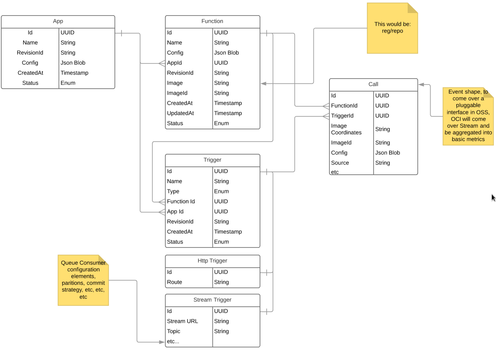
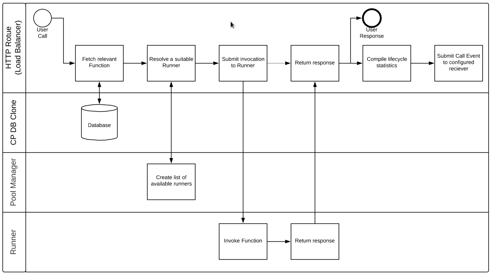

# Fn 0.2

A proposal for modifications to the Fn project, the highlights being:

 * Hardening of Application entity, currently weakly present this now becomes the top level entity underwhich all others are stored. This provides a natural point for authorization and common configuration elements.
 * Introduction of Triggers. These separate routes from Functions, creating an abstraction upon which we can build other methods of Function invocation.
 * Removal of PATCH commands from API. Entity modification will now be achieved by PUT requests, making use of a combination RevisionId now present on every entity, ETag Headers in GET responses and If-Match headers on PUT requests.
 * Cloud Events to be used as the native format throughout Funcation invocation.
 * Cold functions removed.
 * Async, queued functions will now be represented as Triggers of type Stream.
 * Calls and Logs removed from the api. In local usage these valuable features will be provided via CLI tool, in deployments (as in OCI) the scale of these entities precludes thier storage. Therefore, there will be a divergance between the usage models.

The [Swagger file](./swagger.yml) has been updated with these ideas, in abstract the CRUD api looks like:

```
/v1/apps {GET}
/v1/apps/name {GET,PUT,DELETE}
/v1/apps/name/fns {GET}
/v1/apps/name/fns/name {GET,PUT,DELETE}
/v1/apps/name/triggers {GET}
/v1/apps/name/triggers/name {GET,PUT,DELETE}
```

### Data Model



The data model treats both Functions and Triggers as top level entities within an Applications scope.

### Execution Flow



The flow of a function invocation, when made via a http trigger, actually remains largely unchanged from this high level.

## Triggers

A Trigger represents a method by which a function can be invoked.

For example, a Trigger of type HTTP, represents a url at which requests can be sent that will be forwarded to the designated Function for execution. A Trigger of type Stream, will invoke the designated Function with each message that appears on that stream. A Trigger of type Schedule, will invoke the designated Function at the times specified in the Triggers configuration. We'll concentrate on the HTTP Triggers for most of this document, as that is the first type we need to provide to maintain feature parity, the others are just illustrative of the options opened up by this abstraction.

It's worth noting that strictly speaking not *all* function invocations have to come via Triggers. There has been some discussion of so call 'Up Stream Determined Invocations'. These will not be discussed for now, but are seen as important for the future. The only impact on the current design has been to avoid making decisions that would make this use case unworkable.

## Areas Impacted

### Control Plane

### CLI

### Agent

#### Hybrid

### Runner data access


## Implementation plan

We are going to introduce the described functionality in a stage manner, essentially developing the new features in parallel with the current feature set.

The new api will be added to the fn server along side the current routes. There is only one entity that overlaps between the two, Apps, the changes to which can be made additively. Fns and Triggers are new resources and can be just added.

Agent invocation will be expanded to be able to construct function calls using the new domain. This to can be made additively to the code base.

The removal of calls and logs will be staged to first introduce to the debug call from which the CLI tooling to replace that feature can be developed, and then the api endpoints will no longer be being used and can be be removed.

The CLI can be following along as the new API endpoints are being added, but at this point it be moved over to the new api and the old model can be deleted from both.
