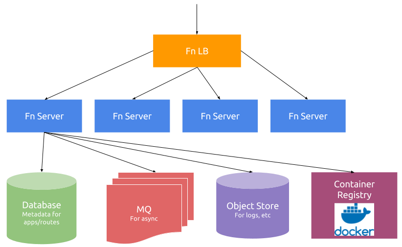

# Running IronFunctions in Production

The [QuickStart guide](/README.md#quickstart) is intended to quickly get started and kick the tires. To run in production and be ready to scale, you need
to use more production ready components.

* Put the IronFunctions API behind a load balancer and launch run several instances of them (the more the merrier).
* Run a database that can scale.
* Asynchronous functions requires a message queue (preferably one that scales).

Here's a rough diagram of what a production deployment looks like:

## Load Balancer

Any load balancer will work, put every instance of IronFunctions that you run behind the load balancer.

**Note**: We will work on a smart load balancer that can direct traffic in a smarter way. See [#151](https://github.com/iron-io/functions/issues/151).

## Database

We've done our best to keep the database usage to a minimum. There are no writes during the request/response cycle which where most of the load will be.

The database is pluggable and we currently support a few options that can be [found here](databases/README.md). We welcome pull requests for more!

## Message Queue

The message queue is an important part of asynchronous functions, essentially buffering requests for processing when resources are available. The reliability and scale of the message queue will play an important part
in how well IronFunctions runs, in particular if you use a lot of asynchronous function calls.

The message queue is pluggable and we currently support a few options that can be [found here](mqs/README.md). We welcome pull requests for more!

## Logging, Metrics and Monitoring

Logging is a particularly important part of IronFunctions. It not only emits logs, but metrics are also emitted to the logs. Ops teams can then decide how they want
to use the logs and metrics without us prescribing a particular technology. For instance, you can [logspout-statsd](https://github.com/iron-io/logspout-statsd) to capture metrics
from the logs and forward them to statsd.

[More about Metrics](metrics.md)

## Scaling

There are metrics emitted to the logs that can be used to notify you when to scale. The most important being the `wait_time` metrics for both the
synchronous and asynchronous functions. If `wait_time` increases, you'll want to start more IronFunctions instances.

