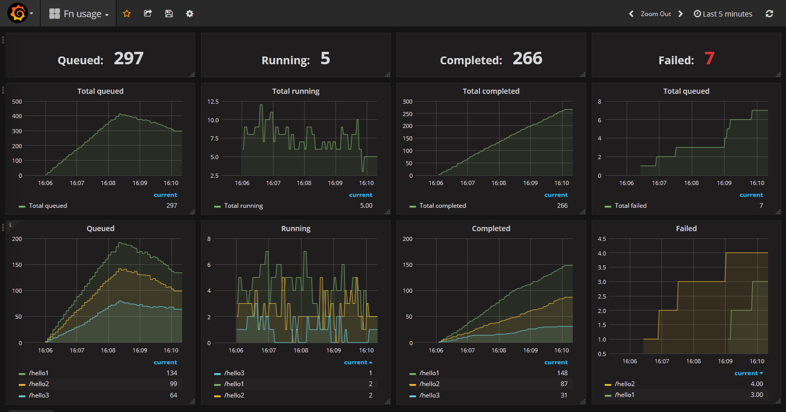
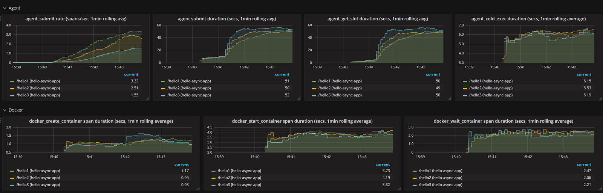
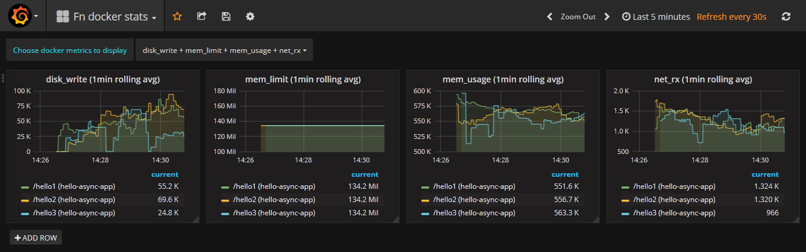

# Display runtime metrics using Prometheus and Grafana

The Fn server exports metrics using [Prometheus](https://prometheus.io/). This allows [Grafana](https://grafana.com/) to be used to display these metrics graphically. 



## Start an Fn server and deploy some functions

Start an fn server

```sh
fn start
```
Deploy one or more functions as required.
See the [front page](/README.md) or any of the other examples for instructions. 

## Examine the endpoint used to export metrics to Prometheus

The Fn server exports metrics to Prometheus using the API endpoint `/metrics`. 

Try pointing your browser at [http://localhost:8080/metrics](http://localhost:8080/metrics).
This will display the metrics in prometheus format.

## Start Prometheus

Open a terminal window and navigate to the directory containing this example.

Examine the provided Prometheus configuration file:

```
cat prometheus.yml
```

This gives

``` yml
global:
  scrape_interval:     15s # By default, scrape targets every 15 seconds.

  # Attach these labels to any time series or alerts when communicating with
  # external systems (federation, remote storage, Alertmanager).
  external_labels:
    monitor: 'fn-monitor'

# A scrape configuration containing exactly one endpoint to scrape:
# Here it's the Fn server
scrape_configs:
  # The job name is added as a label `job=<job_name>` to any timeseries scraped from this config.
  - job_name: 'functions'

    # Override the global default and scrape targets from this job every 5 seconds.
    scrape_interval: 5s

    static_configs:
      # Specify all the Fn servers from which metrics will be scraped
      - targets: ['fnserver:8080'] # Uses /metrics by default
```
Note the last line. This specifies the host and port of the Fn server from which metrics will be obtained. 
If you are running a cluster of Fn servers then you can specify them all here.

Now start Prometheus, specifying this config file.

In the following command, `${GOPATH}/src/github.com/fnproject/fn/examples/grafana/prometheus.yml` is the path of the above Prometheus configuration file. You may need to modify this to use the actual path on your local machine.
```
  docker run --name=prometheus -d -p 9090:9090 \
    -v ${GOPATH}/src/github.com/fnproject/fn/examples/grafana/prometheus.yml:/etc/prometheus/prometheus.yml \
    --link fnserver prom/prometheus
```
Note: The parameter `--link fnserver` means that Prometheus can use `fnserver` to refer to the running Fn server. This requires the Fn server to be running in docker.

Open a browser on Prometheus's graph tool at [http://localhost:9090/graph](http://localhost:9090/graph). If you wish you can use this to view metrics and display metrics from the Fn server: see the [Prometheus](https://prometheus.io/) documentation for instructions. Alternatively continue with the next step to view a ready-made set of graphs in Grafana.

## Start Grafana and load the example dashboard

[Grafana](https://grafana.com/) provides powerful and flexible facilities to create graphs of any metric available to Prometheus. This example provides a ready-made dashboard that displays the numbers of functions that are queued, running, completed and failed. 

Open a terminal window and navigate to the directory containing this example.

Start Grafana on port 3000:
```
docker run --name=grafana -d -p 3000:3000 \
  --link prometheus grafana/grafana
```

Open a browser on Grafana at [http://localhost:3000](http://localhost:3000).

Login using the default user `admin` and default password `admin`.

Create a datasource to obtain metrics from Promethesus:
* Click on **Add data source**. In the form that opens:
* Set **Name** to `PromDS` (or whatever name you choose)
* Set **Type** to `Prometheus`
* Set **URL** to `http://prometheus:9090` 
* Set **Access** to `proxy`
* Click **Add** and then **Save and test**

Import the example dashboard that displays metrics from the Fn server:
* Click on the main menu at the top left and choose **Dashboards** and then **Import**
* In the dialog that opens, click **Upload .json file** and specify `fn_grafana_dashboard.json` in this example's directory.
* Specify the Prometheus data source that you just created
* Click **Import**

You should then see the dashboard shown above. Now execute some functions and see the graphs update.

## Tracing metrics

Tracing spans from the Fn server are available as Prometheus metrics. Each span represents a timed internal operation such as a function call, and has
two main attributes: a name that describes the operation being performed (for example `docker_wait_container`), and its duration in seconds. Each span name is represented by a separate histogram metric, which has a name of the form `fn_span_<span-name>_duration_seconds`. 

If the span is associated with a specific function invocation, the corresponding metric is given the labels `fn_app` and `fn_path` which are set to the application name and function path respectively.

A second example dashboard `fn_grafana_dashboard2.json` in this example's directory displays rate and duration data for any number of spans. Use the dropdown lists at the top of the dashboard to choose which tracing spans to examine.

In the following screenshot, the "Choose spans to display rates" dropdown has been used to select `agent_submit` and `serve_http`, and the "Choose spans to display durations" dropdown, has been used to select `agent_cold_exec`, `agent_get_slot`, `agent_submit`, `docker_create_container`, `docker_start_container` and `docker_wait_container`. 



## Docker statistics

During the execution of the docker container, a selected number of statistics from docker are available as Prometheus metrics. The available metrics are listed in the following table:

| Prometheus metric name |
| ------------- |
| `fn_docker_stats_cpu_kernel` |
| `fn_docker_stats_cpu_kernel`  |
| `fn_docker_stats_cpu_user` |
| `fn_docker_stats_disk_read` |
| `fn_docker_stats_disk_write` |
| `fn_docker_stats_mem_limit` |
| `fn_docker_stats_mem_usage` |
| `fn_docker_stats_net_rx` |
| `fn_docker_stats_net_tx` |
 
 Note that if the container runs for a very short length of time there may be insufficient time to obtain statistics before the container terminates.
 
An example dashboard `fn_grafana_dashboard3.json` in this example's directory displays the available docker statistics. Use the dropdown lists at the top of the dashboard to choose which metrics to examine.



 
